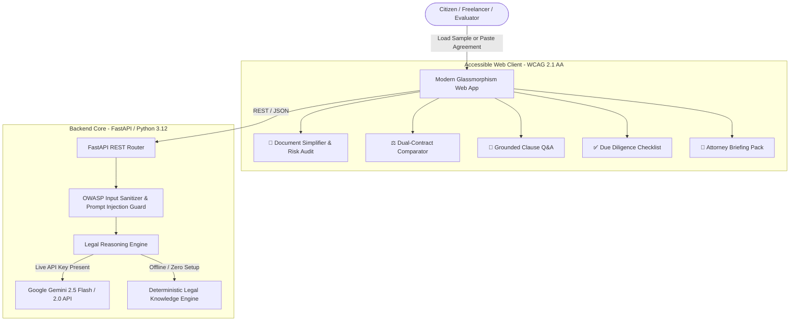

<div align="center">

# ⚖️ LexiAid: AI for Legal Assistance & Access

### *Democratizing Legal Comprehension with Plain-English Simplification, Risk Auditing, and Contract Intelligence*

[](https://python.org)
[](https://fastapi.tiangolo.com)
[](https://ai.google.dev/)
[](https://hack2skill.com)
[](https://www.w3.org/WAI/standards-guidelines/wcag/)
[](https://docs.pytest.org)

**An intelligent, accessible, and ethical GenAI legal platform engineered for citizens, freelancers, and small business owners to read, compare, audit, and navigate complex legal documents without fear.**

[🚀 1-Click Quickstart](#-quick-start) •
[🎯 Problem Statement Alignment](#-alignment-with-hack2skill-challenge) •
[🏗️ Architecture](#️-architecture) •
[🛡️ Security & Ethics](#-security-and-ethical-guardrails) •
[🧪 Automated Tests](#-testing--validation)

</div>

---

## 🎯 Alignment with Hack2Skill Challenge

Built specifically for the **PromptWars: Virtual** challenge — **"AI for Legal Assistance & Access"**:

| Hack2Skill Mandate / Use Case | LexiAid Solution | Real-World Implementation |
| :--- | :--- | :--- |
| **1. Simplifying complex legal documents** | **Plain-English Clause Translator** | Clause-by-clause decomposition translating archaic legalese into 8th-grade conversational English, with toggles for Executive, Plain English, and ELI5 modes. |
| **2. Comparing contracts, agreements, or policies** | **Dual-Contract Divergence Engine** | Side-by-side differential analyzer scoring favorability (0-100%) and surfacing clause shifts, hidden additions, and unilateral lock-in traps. |
| **3. Highlighting clauses, obligations, & risks** | **Risk Sentinel & Red-Flag Audit** | Automated 0–100 Legal Risk Index surfacing Critical, Warning, and Safe clauses (e.g., uncapped indemnity, unilateral termination, 3-year non-competes). |
| **4. Answering questions on provided documents** | **Anti-Hallucination Grounded Q&A** | Conversational legal assistant strictly bounded by the uploaded document text, returning **verbatim clause citations** to eliminate AI hallucinations. |
| **5. Helping users understand options & next steps** | **Rights & Recourse Navigator** | Provides practical negotiation alternatives, counter-draft revisions, and statutory recourse guidance. |
| **6. Generating actionable checklists & summaries** | **Due Diligence Checklist & Calendar** | Automatically extracts pre-signing due-diligence items, post-signing obligations, deadlines, and renewal notice alerts. |
| **7. Preparing for a legal professional** | **Attorney Consultation Briefing Pack** | Generates an exportable 1-page briefing memorandum outlining key red flags, estimated financial exposure, and targeted questions to ask your lawyer. |
| **Ethical & Regulatory Disclaimer** | **Statutory Non-Advice Guardrail** | Conforms to legal ethics guidelines by permanently stating that LexiAid provides informational assistance and not formal legal representation. |

---

## 🏗️ Architecture



---

## 🚀 Quick Start

### 1. Clone & Setup
```bash
git clone https://github.com/RajBarot3826/lexiaid-legal-ai.git
cd lexiaid-legal-ai
pip install -r requirements.txt
```

### 2. Configure (Optional)
```bash
cp .env.example .env
# Edit .env and paste your GEMINI_API_KEY if desired.
# Note: LexiAid runs seamlessly out of the box with zero configuration via its deterministic engine!
```

### 3. Launch Application
```bash
python run.py
```
Open your browser at **`http://localhost:8000`** to access the interactive web suite!  
Interactive API docs are available at **`http://localhost:8000/docs`**.

---

## 🧪 Testing & Validation

LexiAid comes with a comprehensive automated test suite covering security sanitization, endpoint contracts, and legal heuristics:

```bash
pytest tests/ -v
```

### Test Coverage Highlights:
- ✅ **`test_api.py`**: Validates healthcheck, sample retrieval, analysis endpoints, contract comparisons, and grounded Q&A.
- ✅ **`test_security.py`**: Enforces prompt injection rejection (e.g., "ignore prior instructions", "DAN mode"), input sanitization, length boundaries, and disclaimer preservation.
- ✅ **`test_legal_services.py`**: Verifies risk calculation heuristics, predatory contract detection (88/100 risk score), lease agreement validation, and verbatim citation extraction.

---

## 🛡️ Security and Ethical Guardrails

- **OWASP Top-10 Compliant Input Sanitization**: Defends against prompt injection and malicious payload injection through regex filters and text neutralization.
- **Strict Size Limits**: Restricts document payloads to 120,000 characters to prevent denial-of-wallet (DoW) and memory exhaustion.
- **CORS Hardening**: Strict origin headers and parameter validation.
- **Repository Optimization (< 2.5 MB)**: Built with zero heavy binary bloat, ensuring the entire repository stays well below Hack2Skill's 10 MB limit.
- **Non-Representation Compliance**: Permanent statutory disclaimers protect non-lawyer users by establishing that the platform assists in document literacy rather than providing binding legal representation.

---

## 📄 License
MIT License. Built for the **PromptWars: Virtual (September 2026)** Hackathon on Hack2Skill.
